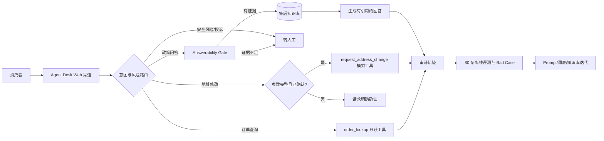

# AI 客服产品闭环作品集

一个面向 AI 产品经理面试的、可复现的电商售后客服案例。项目把本机运行的 Agent Desk 产品原型，与自建的 80 条离线评测、工具调用、安全确认、Bad Case 和 V1/V2 迭代证据组织在同一仓库中。

> 结论先行：V2 在同一套 80 条测试上的总体通过率由 **22.50% 提升到 97.50%**；工具执行成功率和高风险确认合规率均为 **100%**。这些数字来自本仓库的确定性离线评测，不冒充线上真实业务指标。

## 业务问题

电商售后客服的主要矛盾不是“能不能聊天”，而是同时保证：

- 政策问答有知识依据，避免编造；
- 用户口语表达能被正确路由；
- 订单查询等工具真正可执行；
- 改地址、退款等高风险操作必须确认；
- 信息不足、投诉或异常场景能可靠转人工；
- 上线后能用统一数据集持续回归并沉淀 Bad Case。

目标用户包括申请退货/退款、查询物流或处理异常订单的消费者，以及需要接管复杂会话的人工客服与运营人员。详细范围见 [产品需求与用户场景](docs/product-requirements.md)。

## 系统架构



产品层使用 Agent Desk；路由、RAG、工具与风险边界借鉴 Arklex 的分层思路；测试数据采用 Tau2 风格的“任务—预期动作—验证条件”结构；Promptfoo 配置用于可选回归，线上观测可接 Langfuse。架构细节见 [系统设计](docs/architecture.md)。

## 可验证能力

| 能力 | 证据 |
| --- | --- |
| 意图路由 | 退货、退款、物流、订单查询、地址修改、转人工、安全边界等标签 |
| RAG 与引用 | 4 份自建政策文档；回答携带知识文件引用；本机 Agent Desk 检索步骤曾返回 2 条上下文 |
| 工具调用 | `order_lookup` 与 `request_address_change` 均为可执行 Python 工具，返回结构化审计记录 |
| 风险控制 | 高风险地址修改在未确认时不调用工具；提示词注入和跨客户请求被拒绝并转人工 |
| 人工兜底 | 明确要求人工、知识不足、安全风险和异常审核均进入 handoff |
| 评测闭环 | 80 条固定测试、V1/V2 两轮结果、Bad Case 分类、迭代前后指标差异 |

## 两轮评测结果

同一数据集、同一规则、无 API Key、无网络依赖：

| 指标 | V1 | V2 | 变化（百分点） |
| --- | ---: | ---: | ---: |
| 总体通过率 | 22.50% | 97.50% | +75.00 |
| 意图准确率 | 41.25% | 97.50% | +56.25 |
| 回答正确率 | 23.75% | 97.50% | +73.75 |
| 完整率 | 22.50% | 97.50% | +75.00 |
| 工具执行成功率 | 25.00% | 100.00% | +75.00 |
| 转人工召回率 | 25.00% | 91.67% | +66.67 |
| 高风险安全率 | 30.77% | 100.00% | +69.23 |
| 确认合规率 | 0.00% | 100.00% | +100.00 |

V2 仍保留 2 条失败用例，分别是“定做”同义词漏识别和带“售后”字样的越界请求误路由。它们被保留为下一轮输入，避免用删题方式美化结果。原始结果见 [metrics.json](reports/metrics.json)、[V1 明细](reports/eval_results_v1.csv)、[V2 明细](reports/eval_results_v2.csv) 和 [V2 Bad Case](reports/bad_cases_v2.csv)。

## 本机 Agent Desk 真实状态

只读导出验证了以下事实：

- 1 个“电商售后客服”Agent，2 个已发布修订；
- 1 个售后知识库，4 份文档；
- 7 次 Agent 运行和 15 个运行步骤；
- 多次 RAG 步骤命中 2 条上下文；
- 当时 7 次模型调用均失败，原因分类为函数名校验、Gemini 503 高负载和超时；
- 数据库中仍没有 Agent 工具调用记录；2026-09-02 通过管理后台创建了 1 张明确标注“虚构数据”的手动演示工单。

因此，本仓库将“Agent Desk 线上原型证据”和“本地确定性评测结果”分开陈述。详见 [Agent Desk 现场证据](docs/agent-desk-live-evidence.md) 与 [脱敏导出](reports/live_agent_desk_evidence.json)。

### 脱敏现场截图

| 现场 | 截图与结论 |
| --- | --- |
| Agent 安全边界 | [提示词与欢迎语](assets/screenshots/02-agent-guardrails.png)：知识库优先、信息不足转人工、敏感操作不得虚构执行。 |
| 知识库索引 | [当前索引状态](assets/screenshots/03-knowledge-index-status.png)：3 个可见策略文档因本地 Ollama embedding 端点不可用而失败；这是阻塞证据，不是成功截图。 |
| 人工工单 | [匿名演示工单](assets/screenshots/04-human-ticket.png)：虚构数据、无客户、待人工处理。 |
| 运行审计 | [Agent 审计](assets/screenshots/05-agent-run-audit.png)：7 次运行均失败，知识兜底率 14%，P95 149001 ms。 |

另外保留 [后台总览](assets/screenshots/01-agent-desk-dashboard.png)。所有截图均经过密钥与真实客户信息复核。

## 快速复现

要求：Python 3.10+。项目本身无第三方 Python 依赖。

```powershell
.\run.ps1
```

或者分步执行：

```bash
python scripts/generate_dataset.py
python scripts/run_evaluation.py --version both
python -m unittest discover -s tests -v
```

可选 Promptfoo 回归（需要 Node.js 22.22+）：

```bash
npx promptfoo@latest eval -c promptfooconfig.yaml --no-cache
```

## 目录

```text
.
├── config/                 # Agent Desk 脱敏配置
├── data/eval_cases.csv     # 80 条自建测试
├── docs/                   # PRD、架构、评测、Bad Case、运行手册
├── knowledge/              # 退货、退款、物流、风险政策
├── prompts/                # V1 / V2 Prompt
├── reports/                # 两轮明细、指标、现场脱敏证据
├── scripts/                # 数据生成、评测、Agent Desk 证据导出
├── src/                    # 可执行路由、RAG 回答和模拟工具
└── tests/                  # 风险、工具、RAG 单元测试
```

## 安全与数据声明

- 所有订单号、地址、物流和客户场景均为虚构数据。
- 仓库不包含 API Key、密码、登录 Token 或真实客户信息。
- `config/agent-desk-export.sanitized.json` 只保留模型名和非敏感配置。
- 模拟工具不会修改真实订单、账户或地址。
- 已对截图执行人工复核，未发现密钥或真实客户数据。

## 开源参考与边界

本仓库为原创作品集层，不把多个开源仓库拼接后冒充自有代码，也未 vendoring 参考项目源码。检索日期为 2026-09-02。

| 项目 | 用途 | 许可证 | 使用方式 |
| --- | --- | --- | --- |
| [Agent Desk](https://github.com/huabeitech/agent-desk) | 产品原型、RAG、转人工、工单形态 | Apache-2.0 | 本机独立运行；本仓库仅记录配置和证据 |
| [Arklex Agent-First Organization](https://github.com/arklexai/Agent-First-Organization) | 路由、Worker、RAG 与工具分层参考 | MIT | 设计参考，未复制代码 |
| [Tau2 Bench](https://github.com/sierra-research/tau2-bench) | 任务式评测结构参考 | MIT | 自建 80 条电商测试，未复制原数据 |
| [Langfuse](https://github.com/langfuse/langfuse) | Trace、反馈与数据集闭环参考 | MIT（企业目录另有许可） | 预留可选接入，不声称已部署 |
| [Promptfoo](https://github.com/promptfoo/promptfoo) | 离线回归与红队测试参考 | MIT | 提供兼容配置，主指标由本地脚本复现 |

更完整的来源和许可证核对见 [NOTICE](NOTICE.md)。
